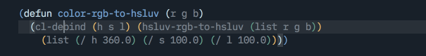

# company-anywhere



Enable company in middle of symbols.

note: this is a wip. there may be some unsupported backends

## Installation

just load this package

```emacs-lisp
(require 'company-anywhere)
```
